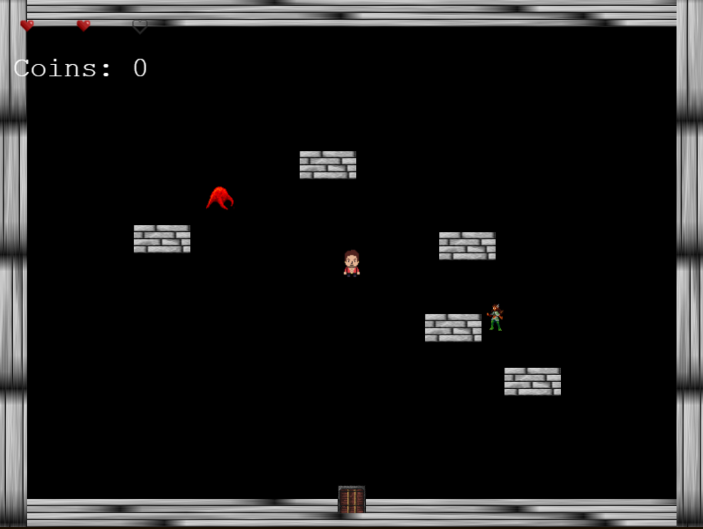

# The Forsaken Depths
Welcome, brave adventurer, to **The Forsaken Depths**—a pixelated plunge into a dungeon so deep, even the shadows have shadows! This retro roguelite game, crafted with Phaser.js, throws you into a world of mystery, danger, and 8-bit glory. Hack through monsters, snag shiny loot, and survive the depths—or get pixelated into oblivion!

 <!-- Replace with an actual screenshot path -->

## About the Game
Step into a realm where the walls are wobbly, the enemies are cheeky, and every room hides a surprise (or a trap!). Inspired by classics like *The Binding of Isaac*, *The Forsaken Depths* features randomly generated maps, tough-as-nails combat, and a heart-pounding quest to conquer the abyss. With its pixel-art aesthetic and retro vibes, this game is a love letter to arcade days—complete with coin drops and epic battles!

### Features
- **Random Dungeons**: Every run is a fresh descent with unique room layouts.
- **Pixel Art Glory**: Dive into a 2D world that screams retro coolness.
- **Tough Enemies**: Face off against blobs, bosses, and more (with projectiles to boot!).
- **Loot & Hearts**: Collect coins and health-ups to stay alive longer.
- **Game Over Drama**: Die gloriously and choose to fight again or escape!

## Getting Started
Ready to brave the depths? Follow these steps to get the game running on your machine!

### Prerequisites
- A web browser (Chrome, Firefox, etc.)
- Node.js (optional, for local development)
- A code editor (e.g., VS Code)

### Playing the Game
Launch the game from index.html.

Click "Start Game" on the retro welcome screen.

Explore, fight, and survive—or face the "Game Over" screen with a chance to "Play Again" or "Exit"!

### Gameplay Controls
Master these moves to conquer the depths:

Movement: Use WASD keys to roam the dungeon.

Shooting:
- Arrow Keys: Fire in four directions (up, down, left, right).
- Mouse Click: Shoot towards the cursor for precision blasts.

Interact: Move to doors to transition rooms (cleared rooms only!).

### Development Details

#### Built With
- Phaser.js: A powerful framework for 2D web games.
- HTML/CSS/JavaScript: Simple yet mighty tech for a retro experience.

#### Project Structure
- index.html: The entry point with game info and canvas.
- game.js: Contains the game logic across TitleScene, MainGameScene, and GameOverScene.
- assets/: Holds all pixel-art images (e.g., sprites, backgrounds).

### Known Issues
- Canvas Warning: "Multiple readback operations using getImageData are faster with willReadFrequently..." — A Phaser performance hint; safe to ignore unless performance lags.
- Extension Errors: Promise rejections from browser extensions (e.g., "User rejected the request")—unrelated to the game; disable extensions if persistent.
